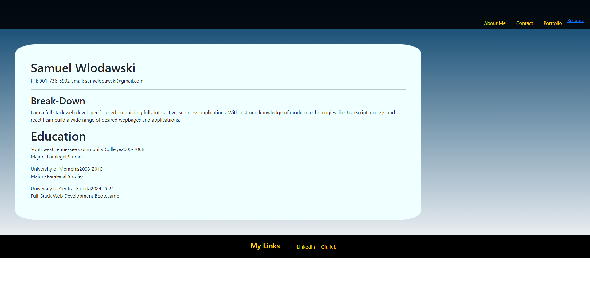

# Sammys React Portfolio

This is my React Portfolio Designed to highlight my abilities and knowledge of React.

## Installation
To install all relevant packages run the npm i command.
To run the build type npm run build.`
Deployed to netlify:
Screenshots:

Deployed App: https://66e07e85f92014751c6a00fc--samwreact.netlify.app/

## Usage

This portfolio will be used to highlight my knowledge and experience with various technologies and packages. It will present an about me page, projects page, resume page and contact page. My knowledge will be highlighted in both my resume and the various projects I either contributed to or built on my own.

## Contributing

Two people contribute to this project either directly or indirectly:
1. Samuel Wlodawski
2. Andres Albornez

## License

No license employed